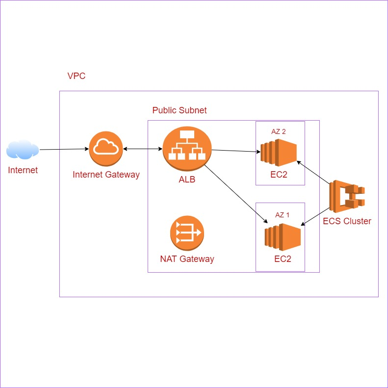

### AWS ECS

## What is ECS?
    ECS is, very basically speaking, a container scheduler. 
    Where you can make them be deployed ECS instances (the one I've chosen to this scenario) or
     serverless strucuture (Fargate) and can be managed by you, connecting to the instance.

## This repo components
    # VPC module
        Where you are able to build VPC, subnets, IGW, NAT Gateways and so on.
    # ECS module
        To build the ECS cluster, services and tasks
    # APP
        This is a very simple app with the intention to show ECS running and deploying containers

## Network Diagram
    This diagram shows the connection all the way from the internet, and reaching the ECS app deployed to EC2s
        For the purpose of this scenario, I have built the apps pointing to public subnets, to easily manage the containers.
        However, on a production environment I'd suggest to deploy to private subnet and, if you need to SSH, use a bastion server.

